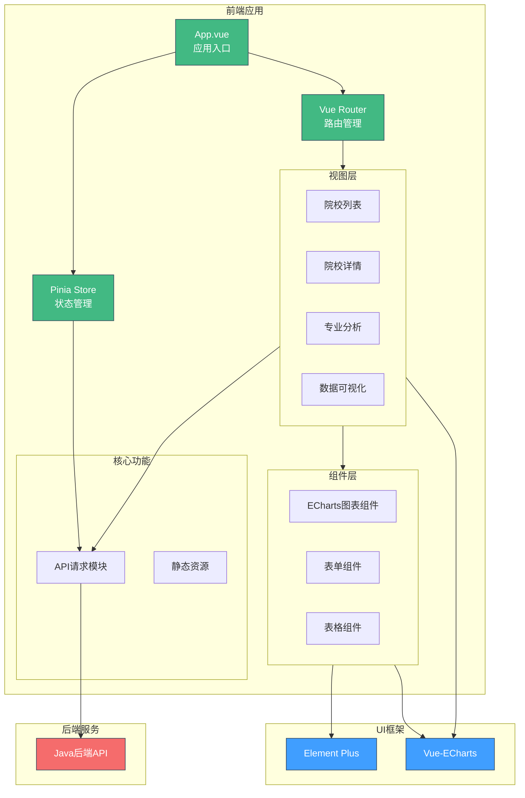

# 🎓 JOSP-choosePhdVue3 - 大学排名查询系统前端


## 📖 项目简介

JOSP-choosePhdVue3是一个大学排名查询系统的前端应用,基于Vue3 + Element Plus构建,提供世界大学排名数据的可视化查询和展示功能。支持QS、US News等排名数据的多维度筛选和图表展示。

**关联后端项目**: [JOSP-choosePhdJava](../JOSP-choosePhdJava)

## 系统架构



## Recommended IDE Setup

[VSCode](https://code.visualstudio.com/) + [Volar](https://marketplace.visualstudio.com/items?itemName=Vue.volar) (and disable Vetur).

## Customize configuration

See [Vite Configuration Reference](https://vite.dev/config/).

## Project Setup

```sh
npm install
```

### Compile and Hot-Reload for Development

```sh
npm run dev
```

### Compile and Minify for Production

```sh
npm run build
```

### Run Unit Tests with [Vitest](https://vitest.dev/)

```sh
npm run test:unit
```

### Lint with [ESLint](https://eslint.org/)

```sh
npm run lint
```
